Implements [Alexa Video Skill](https://developer.amazon.com/docs/video/understand-the-video-skill-api.html) 
Example [Youtube](https://www.youtube.com/watch?v=BTgooV_YEvg)

## Donation
If you want to buy me a beer :) 

## Working features
- Search and Display [Examples](https://developer.amazon.com/docs/video/video-skill-testing-guide.html#search-content)
  - This will display a list of matched Movies/TVshows
- Search and Play [Examples](https://developer.amazon.com/docs/video/video-skill-testing-guide.html#play-content)
- Control playback [Examples](https://developer.amazon.com/docs/video/video-skill-testing-guide.html#control-playback)
- Seeking [Examples](https://developer.amazon.com/docs/device-apis/alexa-seekcontroller.html#adjustseekposition)
- [Setting](https://developer.amazon.com/docs/device-apis/alexa-speaker.html#setvolume) and [Adjusting](https://developer.amazon.com/docs/device-apis/alexa-speaker.html#adjustvolume) volume, and [muting, unmuting](https://developer.amazon.com/docs/device-apis/alexa-speaker.html#setmute)
- Turning On/Off - "Alexa, turn On/Off <device_name>" (Device name is taken from KodiConnect page)
  - This is only available for devices with CEC capability, like RPi, etc. (it checks for `cec-client` binary)

## Steps to set up Kodi Alexa integration
Please follow the tutorial [here](#setup-tutorial)

Please join Discord if you have any questions regarding setup, or in general 
[*Discord link*](https://discord.gg/ryVcz7S)

# Setup tutorial

1. [Create account on Kodi Connect page, to link your Kodi devices](#tutorial---kodi-connect)
    * You don't need to use email and/or password related to any Amazon service.

1. [Install addon on your Kodi device](#tutorial---addon)

1. [Set up AWS and Amazon accounts](#tutorial---amazon-developer-and-aws-account)
    * These are needed to have your Lambda function and Alexa skill hosted.

1. [Set up Lambda and Alexa skill](#tutorial---alexa-skill-and-lambda-function)
    * Deploy Lambda function to your AWS account (manually), and create Alexa skill (through KodiConnect automation)

1. [Link Kodi Device to Alexa Echo devices](#tutorial---enable-alexa-skill)

## Tutorial - Kodi Connect

Navigate to [https://kodiconnect.kislan.sk](https://kodiconnect.kislan.sk)

Click **Register** to move to registration page.
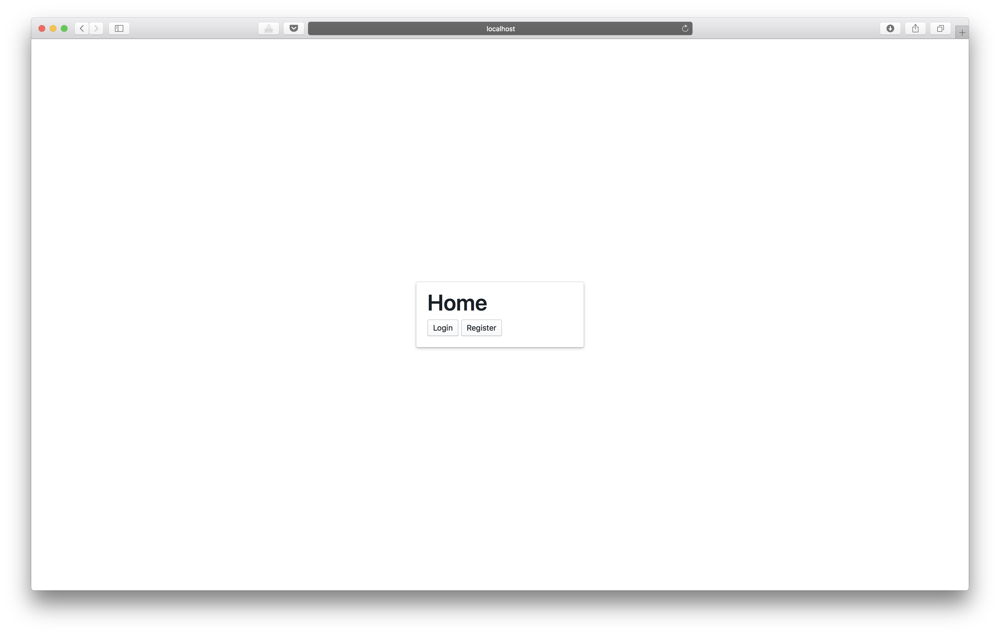

Enter your valid email address, and choose a password (currently it's not possible to reset/change password).

You will also have to enter this password when linking Alexa Skill, and/or Google Assistant "Skill".
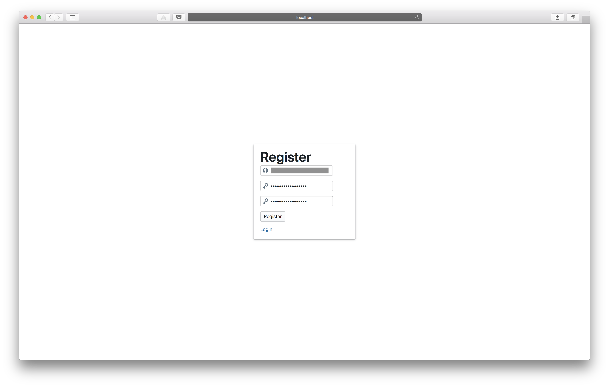

Confirmation page will look like this, and you can close this window.
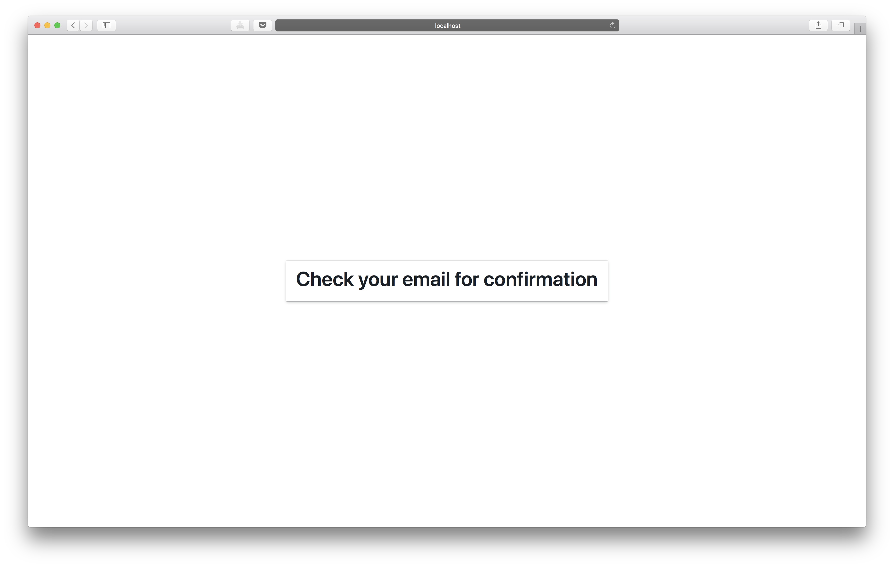

After receiving and open the confirmation email, click on the link, which will open the confirmation page.
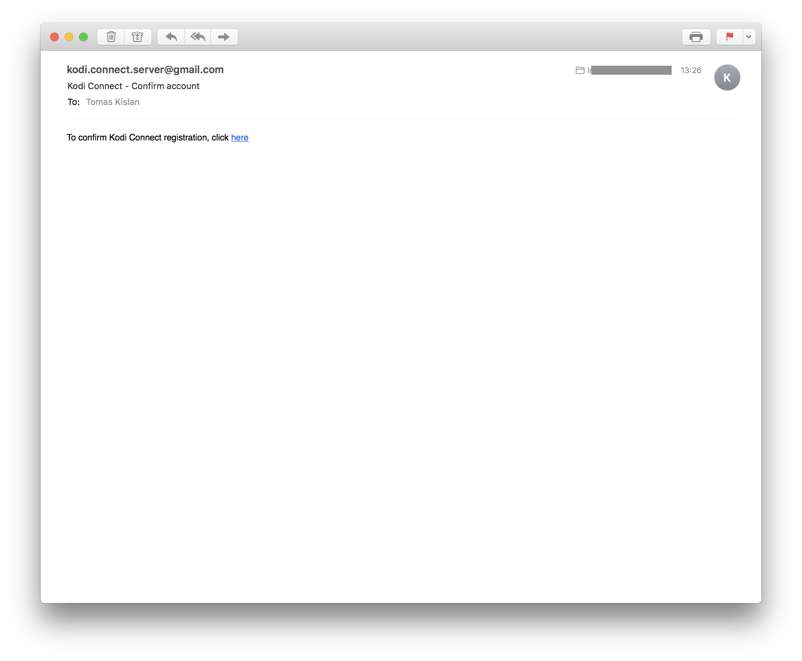

Here just click on the link, which will take you to the Login page.
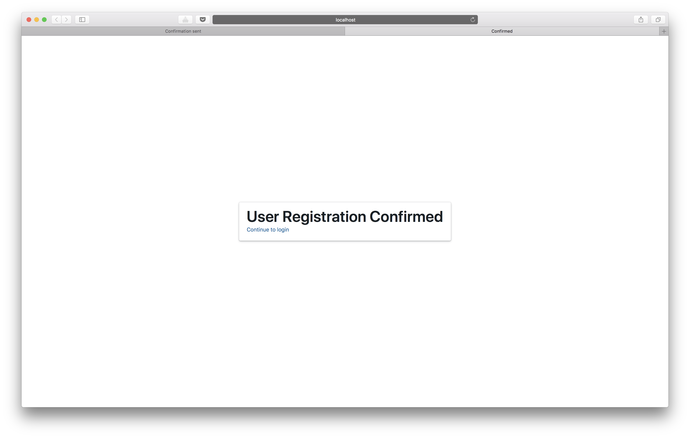

Enter email address and password which you entered on the registration page.

Choose a name for your Kodi instance. You can just enter **Kodi**, as this is unique to your account.

This is only relevant if you plan to use multiple Kodi instances.
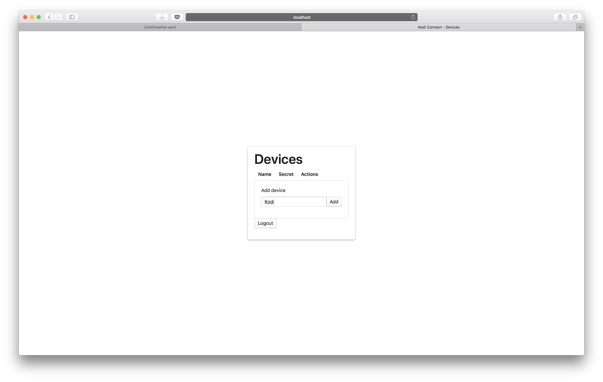

A secret will be generated for your Kodi instance, which will be required for [Kodi Connect Addon](https://github.com/kodi-connect/kodi-connect-addon)
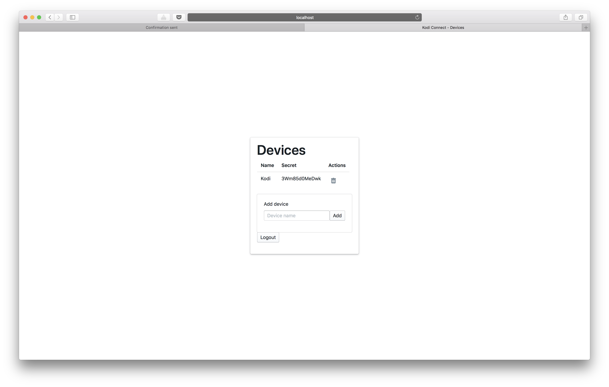

## Tutorial - Addon

* Download newest addon version [here](https://kodi-connect.s3.eu-central-1.amazonaws.com/kodi-connect-addon/plugin.video.kodiconnect-0.2.4.zip)
* Install addon on Kodi - official instructions [here](https://kodi.wiki/view/HOW-TO:Install_add-ons_from_zip_files)
* In addon settings, enter email (one you used to register on Kodi Connect page) and secret (that was generated for your device)
  * Only 1 secret per device can be used, but you can generate as many as you want

**Note**: If updating Addon which introduces new features, you need to relink the Kodi device in Alexa app. Just unlink the device, and go through discovery again. This is because new versions of Addon now report supported features, to ensure backward compatibility, and seamless user experience. This should be the first step, if some of the features is not working for you.

## Tutorial - Amazon Developer and AWS Account
You will need to have a valid Amazon Developer, and AWS account. These are free to sign up for.

For [Amazon Developer](https://developer.amazon.com), go to their page ([developer.amazon.com](https://developer.amazon.com)), and click "Sign In". From there, you can click "Create your Amazon Developer account".

For [Amazon Web Services (AWS)](https://aws.amazon.com), go to their page ([aws.amazon.com](https://aws.amazon.com)), and click "Sign Up". It will ask you for a credit card, but do not worry - AWS includes a "free tier". The service that kodi uses, AWS Lambda, will allow up to 1,000,000 requests, per month, free. You can read more here: [AWS Lambda - Pricing](https://aws.amazon.com/lambda/pricing/).

**For your own safety, you are encouraged to look at [Billing](https://console.aws.amazon.com/billing/home), and set limits/budgets, just in case. If you use other AWS Services, they may be subject to a cost.**

## Tutorial - Alexa skill and Lambda function

### Region Select
**This step is VERY IMPORTANT.**

At the top right of the screen, there is a button next to your username, but before the "Support" button. It may have the name of a region. You must click it and select the correct Lambda Function Region according to your Alexa language.

Amazon provides a list of [regions and languages](https://developer.amazon.com/docs/smarthome/develop-smart-home-skills-in-multiple-languages.html#deploy). Here is a copy:

Skill language                                           | Endpoint Region | Lambda Function Region
---------------------------------------------------------|-----------------|-----------------------
English (US), English (CA)                               | North America   | US East (N. Virginia)
English (UK), French (FR), German, Italian, Spanish (ES) | Europe, India   | EU (Ireland)
English (IN)                                             | Europe, India   | EU (Ireland)
Japanese, English (AU)                                   | Far East        | US West (Oregon)

For example, I am located in Slovakia, but my Amazon Echo devices are set to "English (US)". For this step, I would choose "US East (N. Virginia)".

### Setting up AWS Lambda - Part 1
1. Click on the Services button at the top left. In the list, look for the "Compute" section, and click on "[Lambda](https://console.aws.amazon.com/lambda/home)".
1. Click on the orange "[Create Function](https://console.aws.amazon.com/lambda/home?#/create)" button.
1. Make sure the "Author from scratch" tile is selected.
1. Set the following options:
    * Name - "kodi"
    * Runtime - `Node.js 12.x`
1. Under "Permissions" section expand "Choose or create an execution role"
1. Ensure that "Create a new role with basic Lambda permissions" is selected
1. Click the "Create Function" button.

Leave this window/tab open, as we will need to return back to it. 
But copy the function ARN that is in the upper right corner, which should look something like this: 

`arn:aws:lambda:<region_you_picked>:<long_number>:function:kodi`

### Setting up Alexa Skill
1. Open [Kodi Connect](https://kodiconnect.kislan.sk) page
1. Log in if you're not already
1. On the Devices page, click the "Alexa skill", which will redirect you to the Amazon website to log in (you need to use Amazon account that you have on your Echo devices).
1. After signing in, you will be redirected back to Kodi Connect page, with a single text input and a button.
1. Here enter the Lambda function ARN, that you've or you can copy from the AWS page, where you've created it (`arn:aws:lambda:<region_you_picked>:<long_number>:function:kodi`), and press "Create skill" button
1. Give it a few seconds, and it will create whole skill for you, and present you with the skill ID (`amzn1.ask.skill.2ba4b05b-3bd2-46b1-bbb5-15153ff41a48`). Copy it, as you'll need it in next step.

### Setting up AWS Lambda - Part 2
1. Go back to the page from "Part 1", or if you've closed it, [AWS Lambda](https://console.aws.amazon.com/lambda/home), and go to function "kodi"
1. In the "Designer" section, click on the "+ Add trigger" button, then pick "Alexa Smart Home" from the dropdown.
1. In the "Application ID" box, paste the "Skill ID", that you've copied in the previous section (e.g. `amzn1.ask.skill.2ba4b05b-3bd2-46b1-bbb5-15153ff41a48`).
1. Make sure "Enable Trigger" is checked. Click "Add" at the bottom right.
1. Download the zip file with the Lambda function code from [here](https://kodi-connect.s3.eu-central-1.amazonaws.com/kodi-alexa-video/kodi-alexa-video-package-1.0.zip)
1. Then in the same section, click on the name of your function (should be "kodi").
1. In the "Function code" section below, look for "Code entry type". Click on this menu, and select "Upload a .zip file".
1. Click the "Upload" button, and select the zip file we downloaded earlier (e.g. `kodi-alexa-video-package-1.0.zip`).
1. Click "Save" at the top right of the page, and wait for it to load.

## Tutorial - Enable Alexa skill

Navigate to [https://alexa.amazon.com](https://alexa.amazon.com)

Click Kodi Video under **Your skills**.
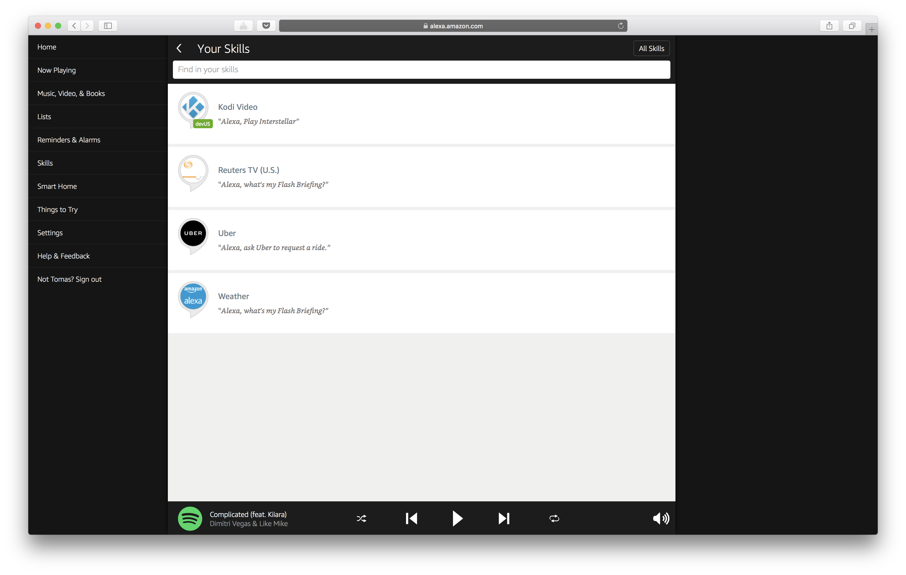

Click on **Enable** button, to start Skill account linking.
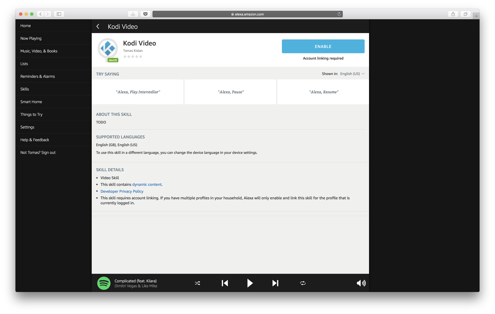

Enter your credentials for Kodi Connect.
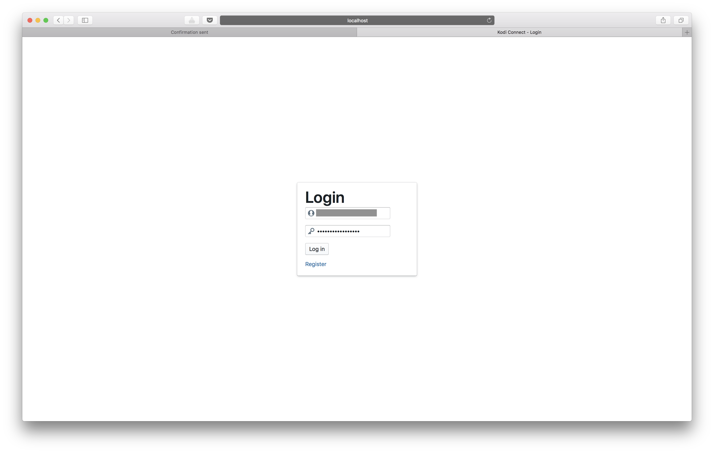

Press **Allow** button, to authorize Amazon with Kodi Connect Server.
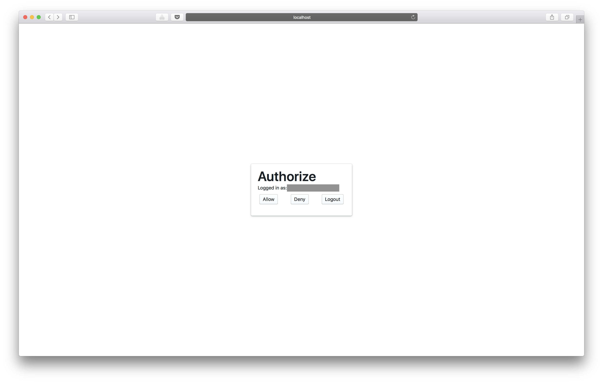

Confirmation page will open after that, which you can close, and return to previous page.
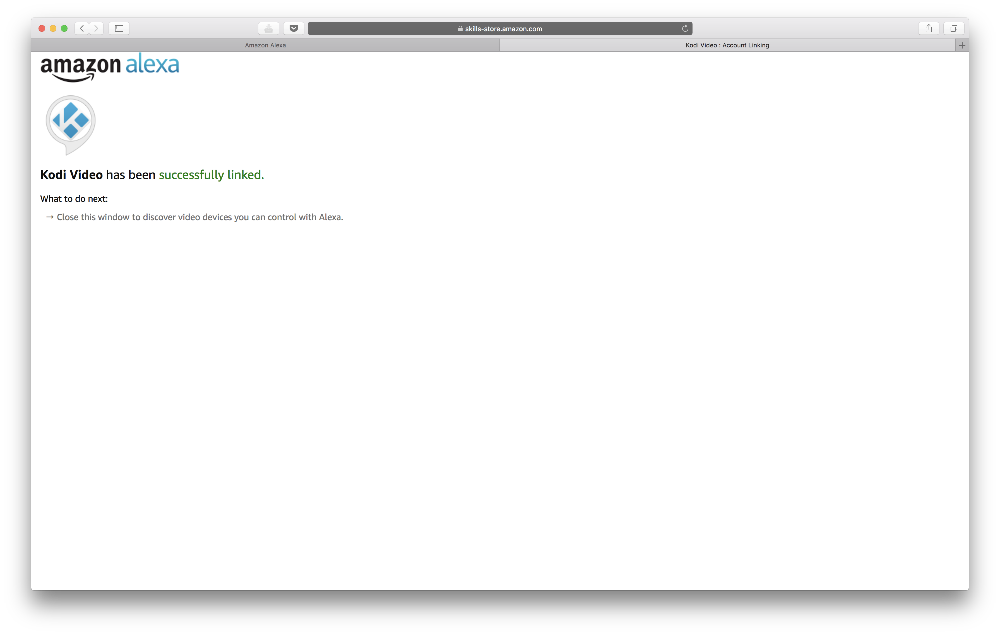

Device discovery will start automatically, which should not take more than few seconds.
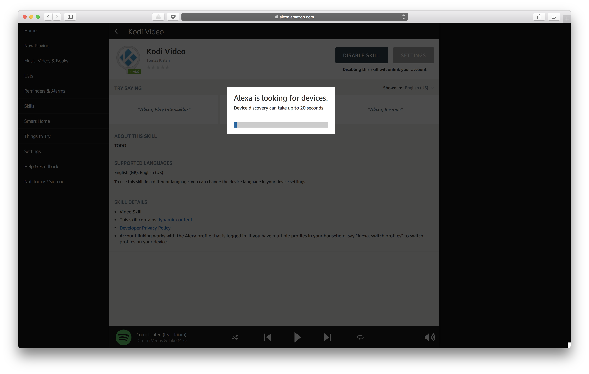

After discovery, at least one Kodi instance should be visible in list. Pick one to connect it to the Echo.
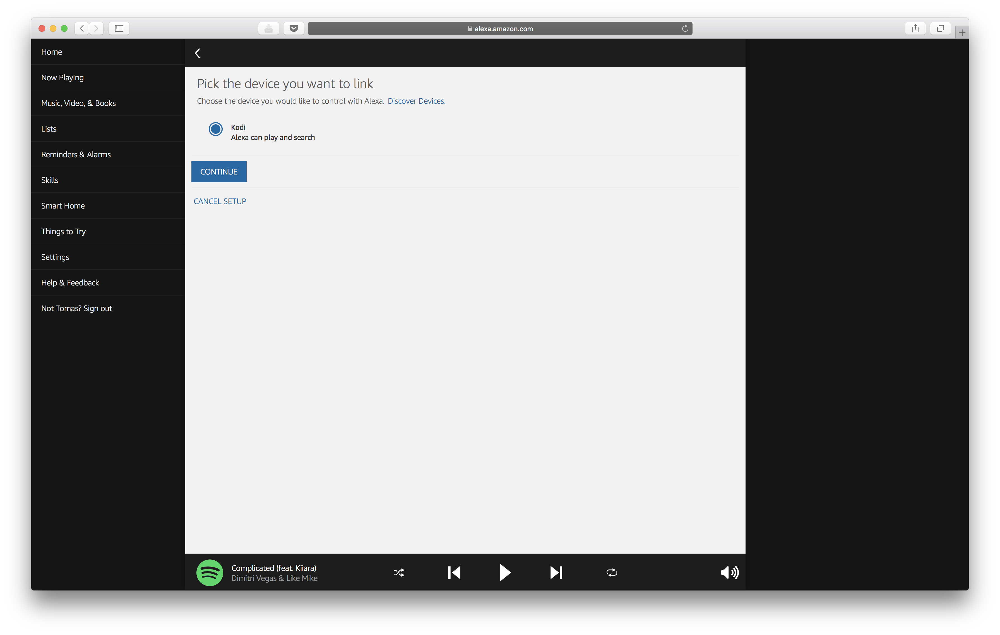

Pick which Echo devices can control the Kodi instance.
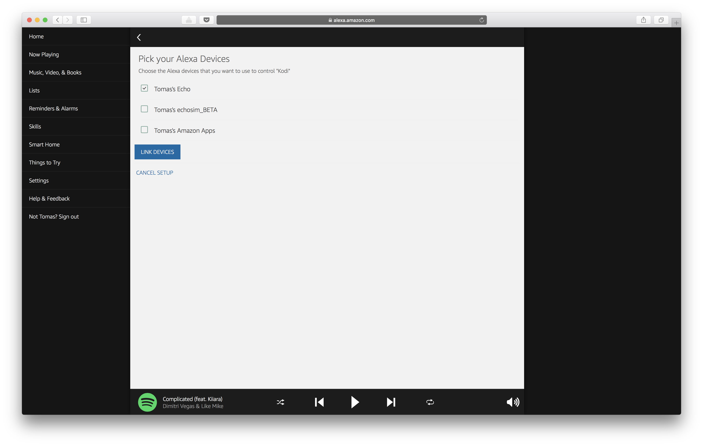

This page just shows you the list of connected Kodi instances. Just click the last link, to go back to skill overview.
 
*!!! Note: There is probably a bug in Alexa app, because after this step, there are no linked devices in the list, but if you continue to the next step, everything works as expected.*
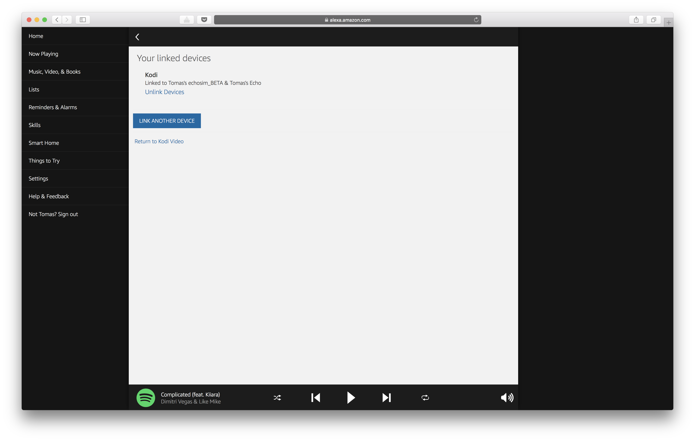

All is set up now, and you can start asking Alexa to play movies and/or tv shows on your Kodi instance.
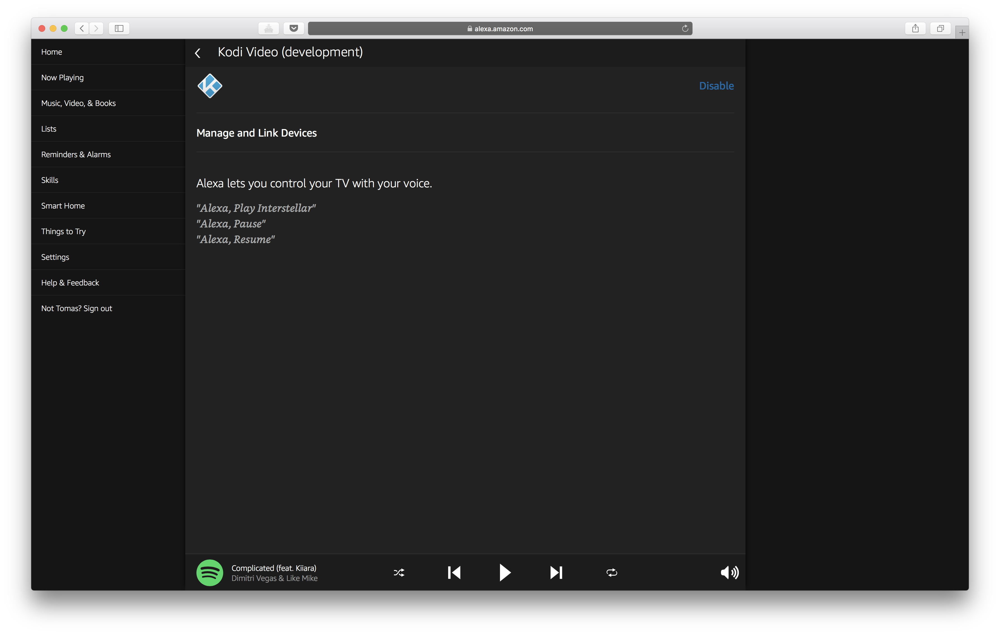
